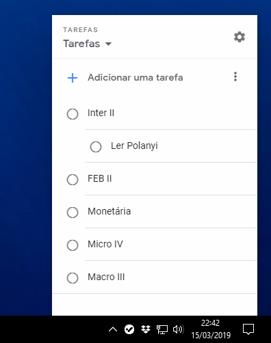

# google-tasks-desktop
#### This is a forked project. You can find the original [here](https://github.com/uenify/google-tasks-desktop)
Desktop version of Google Tasks

I just tried to create desktop version of Google Tasks using electron. It simply displays Gmail web version of Google Tasks.

## Contribute

To run it locally on your own computer:

* [Fork](https://help.github.com/articles/fork-a-repo/) this repository
* [Clone](https://help.github.com/articles/cloning-a-repository/) it to your
  local device
* [Install Yarn](https://yarnpkg.com/en/docs/cli/install) to dependencies
* [Install node](https://nodejs.org/en/) if you don't have it already.
* Run `cd C:<path>\<you>\<saved> `
* Then `npm start`

